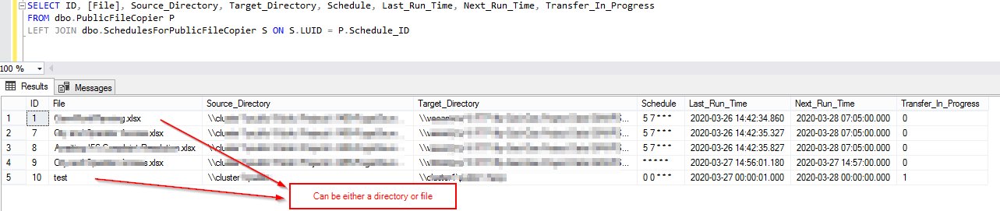
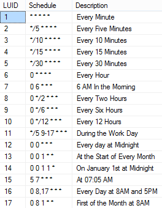
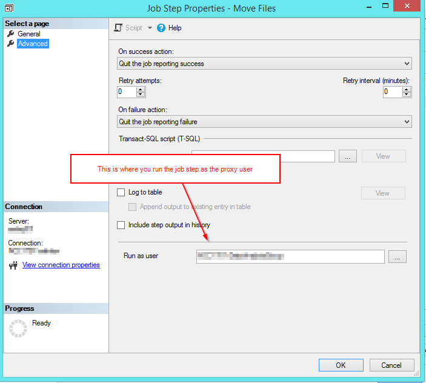

# Move Files and Directories with MS SQL Server

#### Description: The components within provide a solution in which users can schedule file moving task using a table interface without having to interface directly with SQL Agent or other scheduling tools. This is a work in progress have not tried on all file systems.

##### ***Note the dll has already been precompiled for .Net 3.0, and you'll need permissions to load the assembly, it's recommends that you build and configure to your systems specs. 



***

The user can consult the schedule table to see if a schedule already fits their need, if not not they can add in a new schedule using cron expression format. Cron Guru is a good source for validating and creating cron expressions: https://crontab.guru




It's also recommends to create a proxy account if non-sys admins will be using xp_cmdshell. Also the proxy user must not
be a member of the sysadmin group, or it will by-pass the proxy and use the sysadmin credentials. And when you
create an sql agent job, run the job as the proxy user, they just need the lowest SQL agent user permissions. 

```
EXEC sp_xp_cmdshell_proxy_account 'Domain\domain_user', '*******'
```




